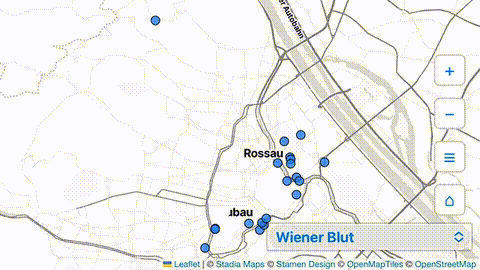

# Own Your Foursquare Lists

As the last living person in Berlin who actually kept using Foursquare for years, I was definitely disappointed when they announced the winding down of the service. I came with the first idealistic wave of Web 2.0, where we believed in crowdsourcing common wisdom. Hell, I even wrote my thesis on the spread of Foursquare in Hungary—only to arrive at the capitalist corporate reality of them selling out our data.

Now that they're gone (no, Swarm can't even show you a comprehendable map), Google Reviews are mostly bot-driven nonsense, and real reviews in Germany get sued off the internet, it's still an open question what tool we should use—maybe even collaboratively—to plan, record, and review real-life experiences.

Putting the whining aside, I didn't want to lose the ability to interact with the lists I'd built over the years. So, I made this mobile-friendly, one-page, map-based list explorer, which you're free to use for your own lists.



---

### **Get the Data**

First, you need to get your Foursquare data:

1. Log in at [`http://foursquare.com/login`](http://foursquare.com/login)
2. Go to [`https://app.foursquare.com/settings/privacy`](https://app.foursquare.com/settings/privacy)
3. Press `Initiate Data Download Request`

Hopefully, within a few days, you'll receive an email that your archive is ready to download. Grab that `zip`.

Now, as with most personal data takeaways, it's a very gray area what *actually* counts as your data. For instance, much of the metadata about venues—especially their locations—doesn't technically belong to you and might not be included in your archive.

To resolve that, we'll use Foursquare's [own release](https://docs.foursquare.com/data-products/docs/access-fsq-os-places) of public data on 100 million venues. Remotely querying this dataset will be handled in the next step. It might take a while—maybe even 10 minutes—but this way you won't need to have the data locally in its full entirety of 11 GBs.

---

### **Process the Data**

You might want to fork and clone this repository as you will need your own repo to deploy your own maps.

Put your data in the `input` folder with something like

```
unzip data-export-223750.zip -d input
```

These scripts will extract location data from the public dataset and merge it with your list data and any tips you left for venues.

```
python3 lists_to_geojson.py
python3 -m venv venv
source venv/bin/activate
pip install -r requirements.txt
./venv/bin/python lists_to_geojson.py
```

---

### **Deploy Your Own Maps**

1. Register for a free account at [Stadia Maps](https://stadiamaps.com) for map tiles — I'm partial to the old [Stamen styles](https://maps.stamen.com/).
2. Register for a free account at [Vercel](https://vercel.com) to serve the app.
3. Connect your GitHub repo to Vercel and publish the app

   * Add a new project
   * Set your GitHub repo
   * Use the default settings

4. Mark your domain (e.g. `yourproject.vercel.app`)
5. Whitelist your Vercel domain in Stadia to serve the map tiles:

   * Go to **Manage Properties & Authentication**
   * **Create a Property**
   * **Configure Authentication**
   * Add your subdomain (e.g. `yourproject.vercel.app`)

That's it—it should work on mobile, especially in landscape mode. The only difference between the behaviour of the desktop and the mobile version is that if you click on an item in the sidebar, it will close, while on the desktop it does not.

You can access/reference/embed your maps directly using the URL from the browser when you're looking at a specific map, something like `https://domain#map`. If you want embed your maps you can hide the dropdown with an URL like `https://domain#map?nodropdown`.